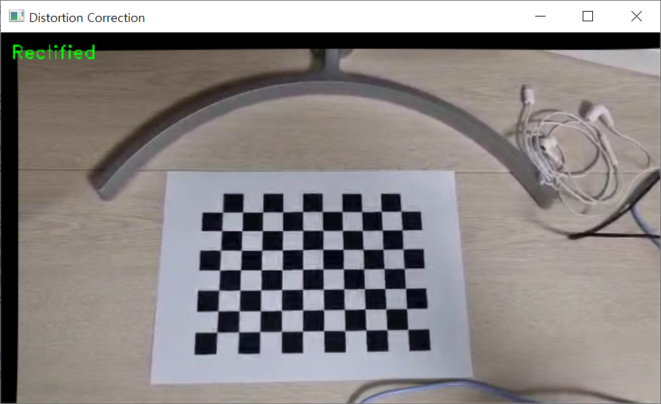

Python의 cv2를 사용하여 카메라의 행렬과 카메라의 렌즈 왜곡계수를 통해 왜곡 고치기  
fix distortion on image through camera's matrix and camera's lens distortion factor

기능: 체크보드를 사용하여 카메라의 행렬과 카메라의 렌즈 왜곡계수 획득, 왜곡된 이미지를 보정  

카메라의 행렬과 카메라의 렌즈 왜곡계수 획등 방법: 첫번째 ipynb를 실행하여 space바를 누른후 엔터로 이미지 저장  

왜곡된 이미지 보정 방법: 두 번째 ipynb의 K(카메라의 행렬)와 dist_coeff(카메라의 렌즈 왜곡계수)에 위에서 구한 값을 넣어 확인  

camera.mp4의 이미지 19장을 통해 얻은 RMSE, K, dist_coeff   

Camera Calibration Results
The number of selected images = 19
RMS error = 0.2977032173655103
Camera matrix (K) = 
[[508.98163886   0.         308.60528522]
 [  0.         500.87912124 164.43847802]
 [  0.           0.           1.        ]]
Distortion coefficient (k1, k2, p1, p2, k3, ...) = [ 4.59282634e-02  1.10172235e-01 -2.56248711e-04 -3.30348010e-03
 -3.50814245e-01
]

위의 결과를 대입하여 보정한 이미지 결과  
  
